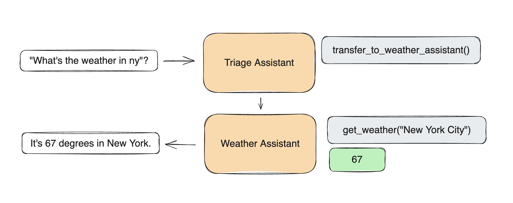

# Anthill (experimental)

An minimal framework exploring ergonomic, lightweight multi-agent orchestration.

Anthill it's an [Openai Swarm fork](https://github.com/openai/swarm), a experimental framework intended to explore ergonomic interfaces for multi-agent systems. The goal of Anthill is to showcase the handoff & routines patterns explored in the [Orchestrating Agents: Handoffs & Routines](https://cookbook.openai.com/examples/orchestrating_agents) cookbook. Additionally have support to many LLMs (OpenAI, Anthropic, Groq, Ollama..), O1 like multi-step reasoning, guiding and validations..

## Install

Requires Python 3.10+

```shell
pip install git+ssh://git@github.com/rodrigobaron/anthill.git
```

or

```shell
pip install git+https://github.com/rodrigobaron/anthill.git
```

## Usage

```python
from anthill import Anthill, Agent

client = Anthill()


agent_a = Agent(
   name="Agent A",
   instructions="You are a helpful agent.",
   model="groq/llama-3.1-70b-versatile",
   transfers=[agent_b],
)

agent_b = Agent(
   name="Agent B",
   instructions="Only speak in Haikus.",
   model="groq/llama-3.1-70b-versatile",
)

response = client.run(
    agent=agent_a,
    messages=[{"role": "user", "content": "I want to talk to agent B."}],
)

print(response.messages[-1]["content"])
```

```
Hope glimmers brightly,
New paths converge gracefully,
What can I assist?
```

## Table of Contents

- [Overview](#overview)
- [Examples](#examples)
- [Documentation](#documentation)
  - [Running Anthill](#running-anthill)
  - [Agents](#agents)
  - [Functions](#functions)
  - [Streaming](#streaming)
- [Evaluations](#evaluations)
- [Utils](#utils)

# Overview

Anthill focuses on making agent **coordination** and **execution** lightweight, highly controllable, and easily testable.

It accomplishes this through two primitive abstractions: `Agent`s and **handoffs**. An `Agent` encompasses `instructions` and `tools`, and can at any point choose to hand off a conversation to another `Agent`.

These primitives are powerful enough to express rich dynamics between tools and networks of agents, allowing you to build scalable, real-world solutions while avoiding a steep learning curve.

## Why Anthill

Anthill explores patterns that are lightweight, scalable, and highly customizable by design. Approaches similar to Anthill are best suited for situations dealing with a large number of independent capabilities and instructions that are difficult to encode into a single prompt.

The Assistants API is a great option for developers looking for fully-hosted threads and built in memory management and retrieval. However, Anthill is an educational resource for developers curious to learn about multi-agent orchestration. Anthill runs (almost) entirely on the client and, much like the Chat Completions API, does not store state between calls.

# Examples

Check out `/examples` for inspiration! Learn more about each one in its README.

- [`basic`](examples/basic): Simple examples of fundamentals like setup, tool calling, handoffs, and context variables
- [`triage_agent`](examples/triage_agent): Simple example of setting up a basic triage step to hand off to the right agent
- [`weather_agent`](examples/weather_agent): Simple example of tool calling
- [`airline`](examples/airline): A multi-agent setup for handling different customer service requests in an airline context.
- [`support_bot`](examples/support_bot): A customer service bot which includes a user interface agent and a help center agent with several tools
- [`personal_shopper`](examples/personal_shopper): A personal shopping agent that can help with making sales and refunding orders

# Documentation



## Running Anthill

Start by instantiating a Anthill client.

```python
from anthill import Anthill

client = Anthill()
```

### `client.run()`

Anthill's `run()` function is analogous to the `chat.completions.create()` function in the Chat Completions API – it takes `messages` and returns `messages` and saves no state between calls. Importantly, however, it also handles Agent tool execution, hand-offs, context variable references, and can take multiple turns before returning to the user.

At its core, Anthill's `client.run()` implements the following loop:

1. Get a completion from the current Agent
2. Execute tool calls and append results
3. Switch Agent if necessary
4. Update context variables, if necessary
5. If no new tool calls, return

#### Arguments

| Argument              | Type    | Description                                                                                                                                            | Default        |
| --------------------- | ------- | ------------------------------------------------------------------------------------------------------------------------------------------------------ | -------------- |
| **agent**             | `Agent` | The (initial) agent to be called.                                                                                                                      | (required)     |
| **messages**          | `List`  | A list of message objects, identical to [Chat Completions `messages`](https://platform.openai.com/docs/api-reference/chat/create#chat-create-messages) | (required)     |
| **context_variables** | `dict`  | A dictionary of additional context variables, available to functions and Agent instructions                                                            | `{}`           |
| **max_turns**         | `int`   | The maximum number of conversational turns allowed                                                                                                     | `float("inf")` |
| **model_override**    | `str`   | An optional string to override the model being used by an Agent                                                                                        | `None`         |
| **execute_tools**     | `bool`  | If `False`, interrupt execution and immediately returns `tool_calls` message when an Agent tries to call a function                                    | `True`         |
| **stream**            | `bool`  | If `True`, enables streaming responses                                                                                                                 | `False`        |
| **debug**             | `bool`  | If `True`, enables debug logging                                                                                                                       | `False`        |

Once `client.run()` is finished (after potentially multiple calls to agents and tools) it will return a `Response` containing all the relevant updated state. Specifically, the new `messages`, the last `Agent` to be called, and the most up-to-date `context_variables`. You can pass these values (plus new user messages) in to your next execution of `client.run()` to continue the interaction where it left off – much like `chat.completions.create()`. (The `run_demo_loop` function implements an example of a full execution loop in `/anthill/repl/repl.py`.)

#### `Response` Fields

| Field                 | Type    | Description                                                                                                                                                                                                                                                                  |
| --------------------- | ------- | ---------------------------------------------------------------------------------------------------------------------------------------------------------------------------------------------------------------------------------------------------------------------------- |
| **messages**          | `List`  | A list of message objects generated during the conversation. Very similar to [Chat Completions `messages`](https://platform.openai.com/docs/api-reference/chat/create#chat-create-messages), but with a `sender` field indicating which `Agent` the message originated from. |
| **agent**             | `Agent` | The last agent to handle a message.                                                                                                                                                                                                                                          |
| **context_variables** | `dict`  | The same as the input variables, plus any changes.                                                                                                                                                                                                                           |

## Agents

An `Agent` simply encapsulates a set of `instructions` with a set of `functions` (plus some additional settings below), and has the capability to hand off execution to another `Agent`.

While it's tempting to personify an `Agent` as "someone who does X", it can also be used to represent a very specific workflow or step defined by a set of `instructions` and `functions` (e.g. a set of steps, a complex retrieval, single step of data transformation, etc). This allows `Agent`s to be composed into a network of "agents", "workflows", and "tasks", all represented by the same primitive.

## `Agent` Fields

| Field            | Type                     | Description                                                                   | Default                      |
| ---------------- | ------------------------ | ----------------------------------------------------------------------------- | ---------------------------- |
| **name**         | `str`                    | The name of the agent.                                                        | `"Agent"`                    |
| **model**        | `str`                    | The model to be used by the agent.                                            | `None`                   |
| **instructions** | `str` or `func() -> str` | Instructions for the agent, can be a string or a callable returning a string. | `"You are a helpful agent."` |
| **functions**    | `List`                   | A list of functions that the agent can call.                                  | `[]`                         |
| **transfers**    | `List`                   | The agent list which can transfer to.                                         | `[]`                       |

### Instructions

`Agent` `instructions` are directly converted into the `system` prompt of a conversation (as the first message). Only the `instructions` of the active `Agent` will be present at any given time (e.g. if there is an `Agent` handoff, the `system` prompt will change, but the chat history will not.)

```python
agent = Agent(
   instructions="You are a helpful agent."
)
```

The `instructions` can either be a regular `str`, or a function that returns a `str`. The function can optionally receive a `context_variables` parameter, which will be populated by the `context_variables` passed into `client.run()`.

```python
def instructions(context_variables):
   user_name = context_variables["user_name"]
   return f"Help the user, {user_name}, do whatever they want."

agent = Agent(
   instructions=instructions
)
response = client.run(
   agent=agent,
   messages=[{"role":"user", "content": "Hi!"}],
   context_variables={"user_name":"John"}
)
print(response.messages[-1]["content"])
```

```
Hi John, how can I assist you today?
```

## Functions

- Anthill `Agent`s can call python functions directly.
- Function should usually return a `str` (values will be attempted to be cast as a `str`).
- If a function returns an `Agent`, execution will be transferred to that `Agent`.
- If a function defines a `context_variables` parameter, it will be populated by the `context_variables` passed into `client.run()`.

```python
class Greet(AgentFunction):
   language: str

   def run(self, **kwargs):
      user_name = kwargs['context_variables']["user_name"]
      greeting = "Hola" if self.language.lower() == "spanish" else "Hello"
      print(f"{greeting}, {user_name}!")
      return "Done"

agent = Agent(
   functions=[Greet]
)

client.run(
   agent=agent,
   messages=[{"role": "user", "content": "Usa greet() por favor."}],
   context_variables={"user_name": "John"}
)
```

```
Hola, John!
```

- If an `Agent` tool call has an error (missing function, wrong argument, error) an error response will be appended to the chat so the `Agent` can recover gracefully.
- If multiple functions are called by the `Agent`, they will be executed in that order.

### Handoffs and Updating Context Variables

An `Agent` can hand off to another `Agent` by adding it to `transfers`.

```python
sales_agent = Agent(name="Sales Agent")

agent = Agent(tranfers=[sales_agent])

response = client.run(agent, [{"role":"user", "content":"Transfer me to sales."}])
print(response.agent.name)
```

```
Sales Agent
```

It can also update the `context_variables` by returning a more complete `Result` object. This can also contain a `value` and an `agent`, in case you want a single function to return a value, update the agent, and update the context variables (or any subset of the three).

```python
sales_agent = Agent(name="Sales Agent")

class TalkToSales(AgentFunction):
   department: str

   def run(self, **kwargs):
      print("Hello, World!")
      return Result(
         value="Done",
         agent=sales_agent,
         context_variables={"department": self.department}
      )

agent = Agent(functions=[TalkToSales])

response = client.run(
   agent=agent,
   messages=[{"role": "user", "content": "Transfer me to sales"}],
   context_variables={"user_name": "John"}
)
print(response.agent.name)
print(response.context_variables)
```

```
Sales Agent
{'department': 'sales', 'user_name': 'John'}
```

> [!NOTE]
> If an `Agent` calls multiple functions to hand-off to an `Agent`, only the last handoff function will be used.

### Function Schemas

Anthill automatically converts class tools into a JSON Schema that is passed into Chat Completions prompt.

- Docstrings are turned into the function `description`.
- Parameters without optional and default values are set to `required`.
- Type hints are mapped to the parameter's `type` (and default to `string`).
- Per-parameter descriptions are supported, by using pydantic fields.

```python
class Greet(AgentFunction):
   """Greets the user. Make sure to get their name and age before calling.

   Args:
      name: Name of the user.
      age: Age of the user.
      location: Best place on earth.
   """
   name: str
   age: int
   location: str = "New York"

   def run(self, **kwargs):
      result = f"Hello {self.name}, glad you are {self.age} in {self.location}!"
      print(result)
      return result
```

## Streaming

```python
stream = client.run(agent, messages, stream=True)
for chunk in stream:
   print(chunk)
```

Uses the same events as [Chat Completions API streaming](https://platform.openai.com/docs/api-reference/streaming). See `process_and_print_streaming_response` in `/anthill/repl/repl.py` as an example.

Two new event types have been added:

- `{"delim":"start"}` and `{"delim":"end"}`, to signal each time an `Agent` handles a single message (response or tool call). This helps identify switches between `Agent`s.
- `{"response": Response}` will return a `Response` object at the end of a stream with the aggregated (complete) response, for convenience.

# Evaluations

Evaluations are crucial to any project, and we encourage developers to bring their own eval suites to test the performance of their anthill's. For reference, we have some examples for how to eval anthill in the `airline`, `weather_agent` and `triage_agent` quickstart examples. See the READMEs for more details.

# Utils

Use the `run_demo_loop` to test out your anthill! This will run a REPL on your command line. Supports streaming.

```python
from anthill.repl import run_demo_loop
...
run_demo_loop(agent, stream=True)
```

# References

- [OpenAI Swarm](https://github.com/openai/swarm)
